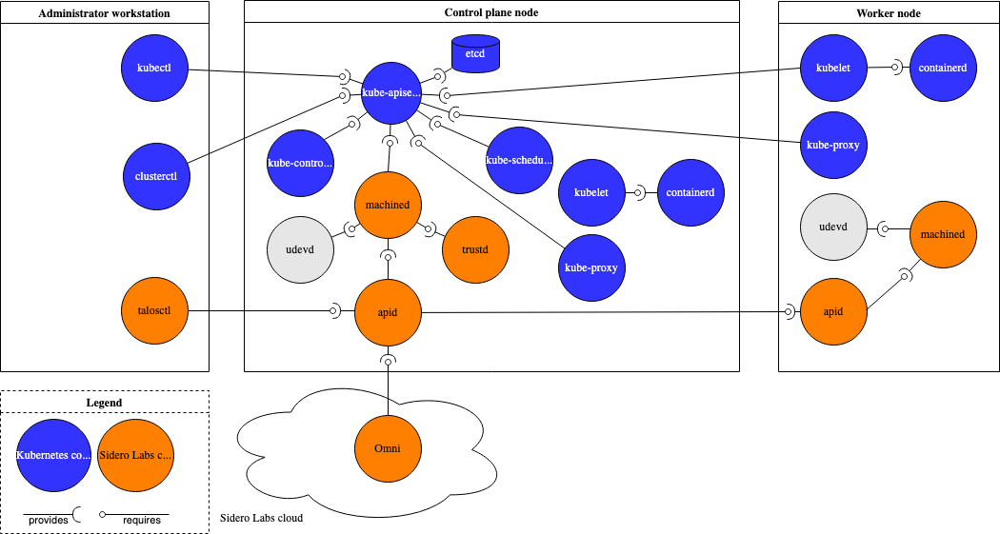

# Talos Linux

Talos is a minimalist, immutable Linux distribution designed specifically to run Kubernetes clusters in production. Instead of behaving like a traditional Linux install, it works more like firmware for your cluster: the entire operating system is managed declaratively, upgraded atomically, and exposed through secure APIs rather than SSH shells.

The API-driven model deserves special attention because it changes how platform teams interact with their infrastructure. Instead of juggling SSH keys, mutable scripts, and ad-hoc procedures, every lifecycle operation funnels through a consistent RPC surface that accepts signed requests, returns machine-readable responses, and can be wired directly into CI/CD pipelines. This enables GitOps-style workflows for the operating system itself, makes auditing straightforward, and eliminates the class of mistakes that come from human drift on individual servers.

**See more about the components of Talos architecture in the [architecture overview](https://docs.siderolabs.com/talos/v1.12/learn-more/components).**

## Why no shell or SSH?
*Copy/pasted from [talos.dev FAQ](https://www.talos.dev/faq/)*
Since Talos is fully API-driven, all maintenance and debugging operations are possible via the OS API. We would like for Talos users to start thinking about what a “machine” is in the context of a Kubernetes cluster. That is, that a Kubernetes cluster can be thought of as one massive machine, and the nodes are merely additional, undifferentiated resources. We don’t want humans to focus on the nodes, but rather on the machine that is the Kubernetes cluster. Should an issue arise at the node level, talosctl should provide the necessary tooling to assist in the identification, debugging, and remediation of the issue. However, the API is based on the Principle of Least Privilege, and exposes only a limited set of methods. We envision Talos being a great place for the application of control theory in order to provide a self-healing platform.

Unlike traditional Linux distributions, Talos does not include a package manager, shell, or SSH server. 

*You'll find alternative of linux command line tools via `talosctl` commands. For example:*
https://docs.siderolabs.com/talos/v1.12/learn-more/talos-for-linux-admins

## Why It Is Cool
Upgrades feel as safe as rolling out a new container image because the OS swap is atomic and reversible. Security defaults stay tight: there is no package manager to exploit, no shell to break into, and TPM plus secure-boot fits right in. Consistency shines since dev, staging, and prod all boot from the same artifact, which shrinks debugging time and audit scope. Because Talos ships only what Kubernetes needs, it boots fast, sips resources, and drastically lowers the CVE surface area. Automation fans get first-class tooling through TalHelper, Terraform, Cluster API, and anything else that can spit out the declarative config.

## Reliability Guarantees

Atomicity and immutability are the backbone of those guarantees. Atomicity means every OS upgrade happens as an all-or-nothing transaction: Talos writes the new image to an alternate partition, verifies it, and only then flips a pointer, so failure mid-upgrade never leaves a machine in limbo. Immutability means that image is read-only at runtime, so no one can sneak in a stray package or tweak; the only way to change the system is to supply a new declared state. Together they ensure that every node either runs the exact version you intended or it cleanly rolls back to the previous one, with no in-between snowflakes.

## Typical Workflow
Start by writing the cluster topology and node roles in YAML. Feed that spec into TalHelper, Terraform, or your own pipelines to render Talos machine configs along with any sealed secrets. Boot the machines from ISO, PXE, or cloud images; as soon as they discover their config they bootstrap themselves and knit together the control plane. Afterwards every lifecycle task—reboots, upgrades, certificate rotation—flows through the Talos API, keeping operations scripted and auditable.

## When To Reach For Talos
Talos shines when you are self-hosting Kubernetes on bare metal, edge gear, or homelab rigs and want consistency without babysitting. It is a strong fit for regulated environments where immutable infrastructure, GitOps workflows, and auditable change histories are non-negotiable. Teams tired of snowflake servers or converged infrastructure drift can treat Talos as a clean slate that scales from a single box to a rack without changing operating procedures.

## Comparison Snapshot
| Feature | Talos | Traditional Linux Node |
| --- | --- | --- |
| Access model | API-driven, no SSH | SSH + config management |
| Upgrades | Atomic, immutable image | Package-level, imperative |
| Default services | Kubernetes essentials only | General-purpose OS stack |
| Drift control | Declarative configs | Depends on tooling |
| Security posture | Hardened, minimal surface | Varies by distro and hardening |

## Learn More
Head to [https://www.talos.dev](https://www.talos.dev) for the full documentation, then follow the walkthrough in [docs/create-first-cluster.md](create-first-cluster.md) to get a cluster running with this repository.

Talos turns the OS into a reliable building block so you can focus on the Kubernetes workloads that matter.